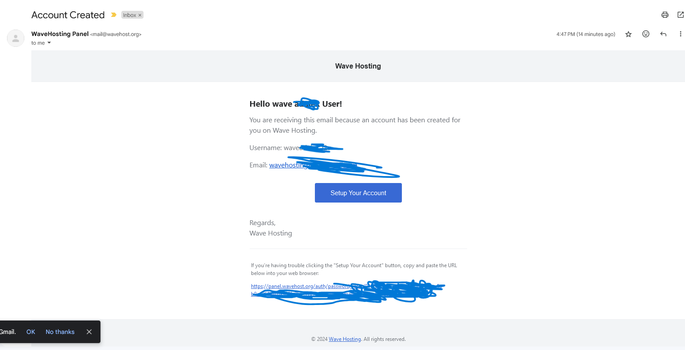

# Accessing your product

Our Discord bot, Minecraft, & Web hosting both use the same panel [https://panel.wavehost.org](https://panel.wavehost.org)

If you are a new user, after you bought a service you should have gotten a email to setup your account,

<figure><figcaption></figcaption></figure>

Press the button that says "Setup your account" or press the link at the bottom of the email if the button doesn't work. After you click either the button or link, follow the instructions to make a password for the panel. Once you have done that you can login and your product will be there.

<figure><figcaption></figcaption></figure>
