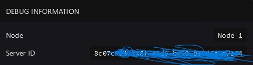

# Frequently asked Questions

Q: Ports aren't open!

A: Port forwarding isn't working correctly, we are working it out with our ISP to get this fixed the right away ASAP

If you need your ports open, make a ticket in the Discord or make a ticket on the dashboard.

Q: Do you delete active servers?

A: Yes we do, if you bought a free bot service and we see you are not using it for 7 days, we will terminate the product to free up storage.

Note if you buy the same product multiple times after its been deleted there will be possible account termination.

Q: What is my server ID?

A: Go to a server, > settings and its under debug information

<figure><figcaption></figcaption></figure>

Q: When will I ever need the server ID?

A: The server ID is something we need if you are asking for support regarding your server, or if you want to proxy your server,  you should also have a copy of it just in case there is data loss, we have backup servers that backup ours nodes in the event there is data loss, If there is data loss we can use your server ID to recover the files from when they were last backed up.

Note: You should always have a backup of your server files. We are not responsible for data loss.

Q: What are you not allowed to host?

A: You are not allowed to host the following. Note this is not a full and complete list: DDoS tools, scrapers, Minecraft servers on normal Java servers,  servers that purposely use up resources (them folks using V3 aoi.js), Discord ratelimiters, PteroVM, Whatapp Bots, servers attempting root access, nitro generators, token grabbers, etc. Anything against Discord Terms of Service is also off limits, the [Terms of Service](https://my.wavehost.org/tos) also has more info.

Q: How do I change my Discord host from Node.Js to Python.

A: You will need to make a ticket on the Billing panel if you would like to switch.
