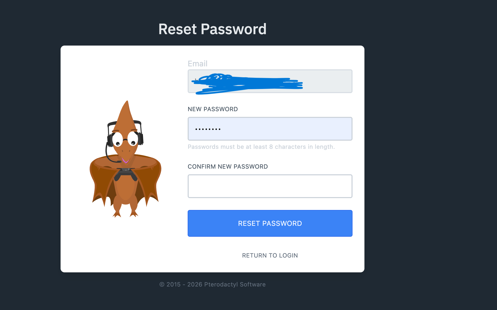

# Panel Login

After you bought your service you should have gotten a email with the Subject "**Account Created"**

<figure><figcaption></figcaption></figure>

You need to click on "Setup Your Account" (Or use the link at the bottom of the email) to create a password on the panel.

<figure><figcaption></figcaption></figure>

&#x20;Then after that you will be logged in.

